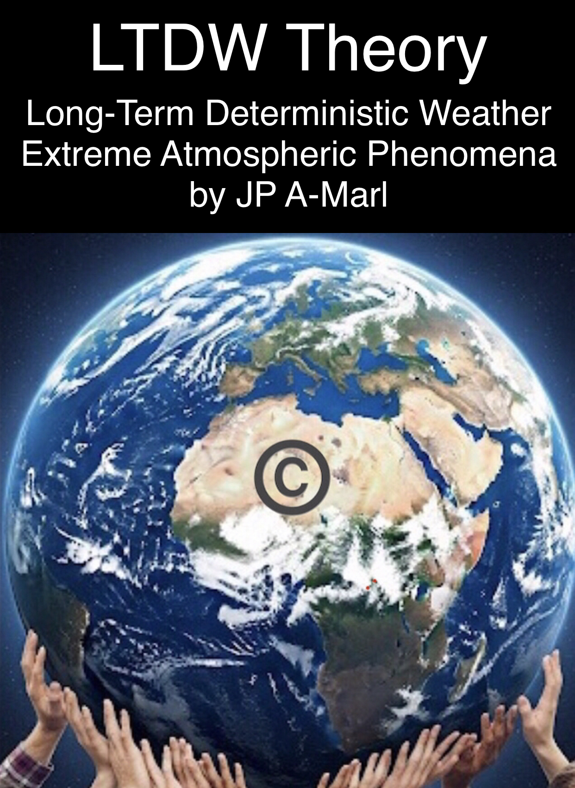
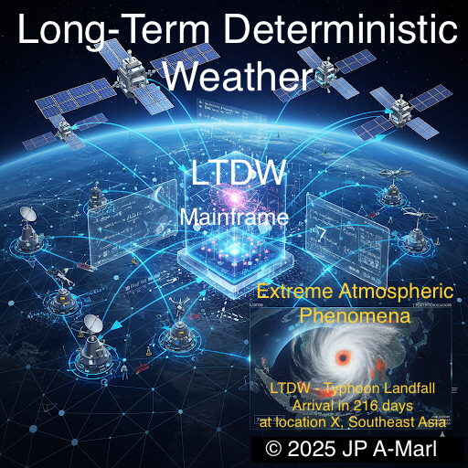

license: All rights reserved

Copyright © 2025/6 JP A-Marl

---

# Published on the 03Dec2025 

https://zenodo.org/records/17798798 

DOI 10.5281/zenodo.17798798

---

# UPDATED VERSION -

## Version - v1.7 13May2026

Zenodo v1.7 dated May-13, 2026

(supersedes Executive Summary Sponsorship heading)

---

# LTDW Weather Theory - Year-Ahead Deterministic Storms, Hurricane & Typhoon Landfall and Heat Waves and Cold Snaps Forecast causing Loss of Life and Severe Damage

---

Keywords / Topics / Tags:
LTDW, Long-Term Deterministic Weather, year-ahead hurricane forecast, deterministic landfall, catastrophe model, cat-bond, sovereign risk transfer, extreme weather prediction, climate risk engineering, JP A-Marl LTDW Weather Theory

---

# JP A-Marl LTDW Weather Theory

This Theory is part of a suite of intellectual contributions designed for the next stage of evolution of humanity pertaining to HAUF Human-Artificial Unified Framework, including the Uni-Civ-Trilogy (Theorem-Book-Economic Outlook), and the Universal AI/AGI/ASI Ethical Charter and follow-up modules.

## LTDW - Long-Term Deterministic Weather for EAP - Extreme Atmospheric Phenomena over a long period of time (1 year)

### 1. Opening Statement: Why This Matters Now

As climate volatility intensifies and predictive models struggle to keep pace with planetary-scale disruptions, the need for deterministic weather forecasting has never been more urgent.
Today’s probabilistic systems offer ranges and likelihoods, but they fall short of delivering the precision required to anticipate and mitigate extreme atmospheric phenomena.
This is a task of generational significance, one we begin today with the hope of seeing it concluded within a few years once we can have Long-Term Deterministic Weather for Extreme Atmospheric Phenomena at 99.9% confidence (up to 1 year), as synthetic cognition evolves to meet the scale and complexity of Earth’s atmosphere.

### 2. Definition of Long-Term Deterministic Weather for Extreme Atmospheric Phenomena:

A single, specific forecast for a given time and location, predicting — up to one year in advance — future weather conditions related to temperature, precipitation, and wind that generate big and extreme atmospheric phenomena such as monsoons, atmospheric rivers, storms, thunderstorms, hurricanes, typhoons, heatwaves, cold waves, and abnormal hot or cold seasonal temperatures.
This approach is based on running a computer model once, using the necessary data and capabilities to produce a precise outcome (designed for 99.9% confidence - a failure event pf 1/1000), rather than a range of possibilities or probabilities.

### 3. Mission Statement 

This Theory Solution will define the necessary data, mathematical models, and capabilities — including data-gathering equipment, hardware and software required to process large datasets through mathematical models.
The objective is to encode an interoperable and essential set of conditions required to run deterministic weather forecasting over long time horizons.

## 4. JP A-Marl LTDW Theory Solution is now complete and published 

Only the Executive Summary has been published. 

The full LTDW Theory will be avaiable for the next stage of human-AI evolution for its implementation at planetary scale.

## 5. A Blockchain Financial Instrument for LTDW

A blockchain‑based financial instrument offers a clean, auditable, and neutral pathway for LTDW's hardware and software implementation.

Read about in https://medium.com/@jpamarl.phi/global-warming-a5069b929729

## Follow up on LTDW Theory

Interested parties leading climate global resilience and innovation are invited to contact the author.

## JP A-Marl

JP A-Marl is a civilizational thinker and architect designing our New Civilization as the next stage of Human-AI-Planet evolution.

The Future is Here!

JP A-Marl, 2026

Contact: jpamarl.phi@gmail.com

